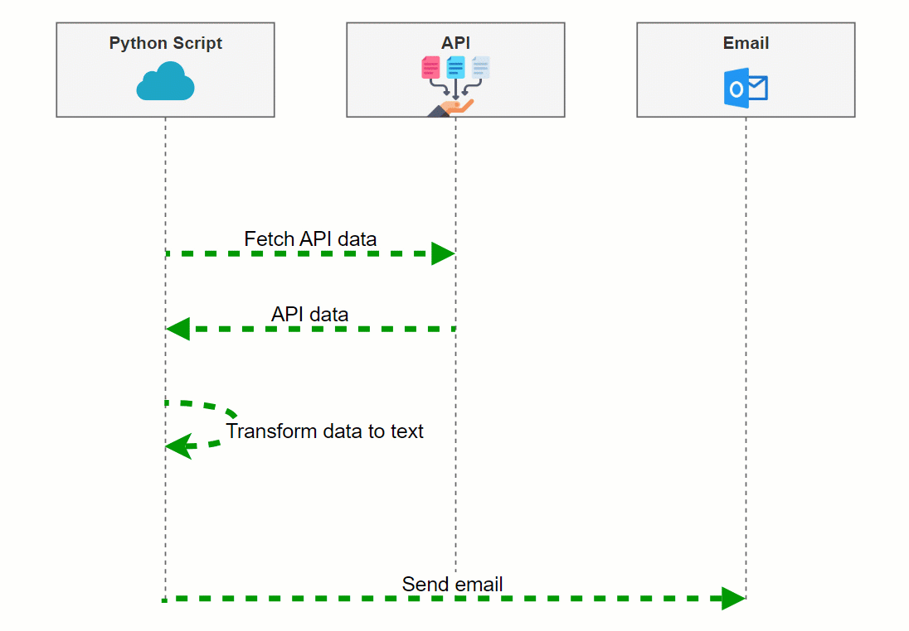

# Automate Your Morning Using Python

Automate your mornings with Python by receiving an email that compiles your daily news, weather, and to-do list. This script utilizes various APIs to gather your morning information and sends it to your Outlook email, ensuring you start your day informed and organized.

## Video Tutorial (Coming soon!)
[](https://youtu.be/XXX)

## How It Works

1. **API Integration:** The script pulls live data from news, weather, and to-do APIs.
2. **Email Automation:** Compiles the data into a friendly morning message and sends it to your Outlook email via SMTP.
3. **Python Anywhere Hosting:** The script can be hosted on PythonAnywhere for consistent daily updates.



## Prerequisites

To use this script, you must have an `.env` file with your API keys and email credentials:
```
NEWS_API_KEY=your_news_api_key
TODOIST_API_KEY=your_todoist_api_key
WEATHER_API_KEY=your_weather_api_key
EMAIL_SENDER=your_email@outlook.com
EMAIL_PASSWORD=your_password
```

Additionally, ensure the following Python packages are installed as per `requirements.txt`:
```
python-dotenv==1.0.0
Requests==2.31.0
todoist_api_python==2.1.3
```

## Usage

Simply clone the repository, set up your `.env` file with the necessary keys and credentials, ensure all requirements are installed, and execute the script to start receiving your daily morning updates.

## API Resources

- **News:** [MediaStack](https://mediastack.com/)
- **To-Do Items:** [Todoist](https://app.todoist.com/)
- **Weather:** [Weatherbit](https://www.weatherbit.io/)
- **Email Setup:** [Outlook Account Creation](https://www.microsoft.com/en-us/microsoft-365-life-hacks/organization/how-to-create-outlook-email-account)


## 🤓 Check Out My Excel Add-ins
I've developed some handy Excel add-ins that you might find useful:

- 📊 **[Dashboard Add-in](https://pythonandvba.com/grafly)**: Easily create interactive and visually appealing dashboards.
- 🎨 **[Cartoon Charts Add-In](https://pythonandvba.com/cuteplots)**: Create engaging and fun cartoon-style charts.
- 🤪 **[Emoji Add-in](https://pythonandvba.com/emojify)**: Add a touch of fun to your spreadsheets with emojis.
- 🛠️ **[MyToolBelt Add-in](https://pythonandvba.com/mytoolbelt)**: A versatile toolbelt for Excel, featuring:
  - Creation of Pandas DataFrames and Jupyter Notebooks from Excel ranges
  - ChatGPT integration for advanced data analysis
  - And much more!


## 🤝 Connect with Me
- 📺 **YouTube:** [CodingIsFun](https://youtube.com/c/CodingIsFun)
- 🌐 **Website:** [PythonAndVBA](https://pythonandvba.com)
- 💬 **Discord:** [Join the Community](https://pythonandvba.com/discord)
- 💼 **LinkedIn:** [Sven Bosau](https://www.linkedin.com/in/sven-bosau/)
- 📸 **Instagram:** [sven_bosau](https://www.instagram.com/sven_bosau/)

## Support 
If you appreciate the project and wish to encourage its continued development, consider [supporting my work](https://pythonandvba.com/coffee-donation).
[](https://pythonandvba.com/coffee-donation)

## Feedback & Collaboration
For feedback, suggestions, or potential collaboration opportunities, reach out at contact@pythonandvba.com.

