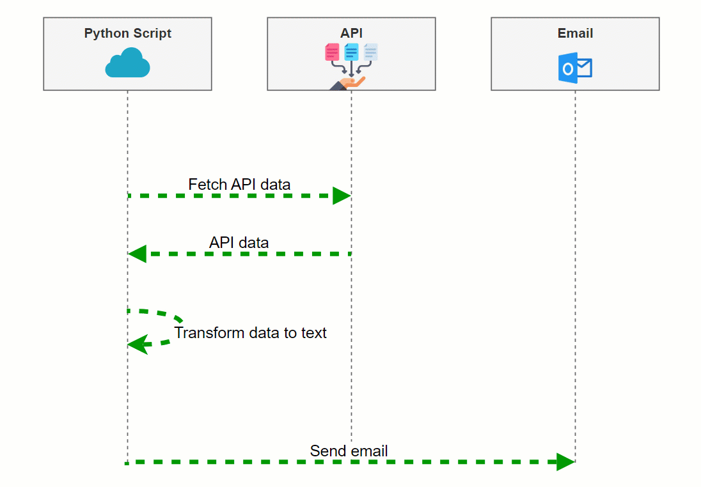

# Automate Your Morning Using Python

Automate your mornings with Python by receiving an email that compiles your daily news, weather, and to-do list. This script utilizes various APIs to gather your morning information and sends it to your Outlook email, ensuring you start your day informed and organized.

## Video Tutorial (Coming soon!)
[](https://youtu.be/XXX)

## How It Works

1. **API Integration:** The script pulls live data from news, weather, and to-do APIs.
2. **Email Automation:** Compiles the data into a friendly morning message and sends it to your Outlook email via SMTP.
3. **Python Anywhere Hosting:** The script can be hosted on PythonAnywhere for consistent daily updates.



## Prerequisites

To use this script, you must have an `.env` file with your API keys and email credentials:
```
NEWS_API_KEY=your_news_api_key
TODOIST_API_KEY=your_todoist_api_key
WEATHER_API_KEY=your_weather_api_key
EMAIL_SENDER=your_email@outlook.com
EMAIL_PASSWORD=your_password
```

Additionally, ensure the following Python packages are installed as per `requirements.txt`:
```
python-dotenv==1.0.0
Requests==2.31.0
todoist_api_python==2.1.3
```

## Usage

Simply clone the repository, set up your `.env` file with the necessary keys and credentials, ensure all requirements are installed, and execute the script to start receiving your daily morning updates.

## API Resources

- **News:** [MediaStack](https://mediastack.com/)
- **To-Do Items:** [Todoist](https://app.todoist.com/)
- **Weather:** [Weatherbit](https://www.weatherbit.io/)
- **Email Setup:** [Outlook Account Creation](https://www.microsoft.com/en-us/microsoft-365-life-hacks/organization/how-to-create-outlook-email-account)

## Learn Excel Automation with Python
If this repo helped you, my [Excel Automation Course](https://pythonandvba.com/excel-automation-course/) teaches the full workflow from zero: Python for Excel users, xlwings, pandas and real projects.

Also check out my other [tools and templates](https://pythonandvba.com/solutions).

## Connect with Me
- **YouTube:** [CodingIsFun](https://youtube.com/c/CodingIsFun)
- **Website:** [PythonAndVBA](https://pythonandvba.com)
- **LinkedIn:** [Sven Bosau](https://www.linkedin.com/in/sven-bosau/)
- **Contact:** [Get in Touch](https://pythonandvba.com/contact)
## Support
If you find this project helpful, consider buying me a coffee. 

[](https://pythonandvba.com/coffee-donation)
